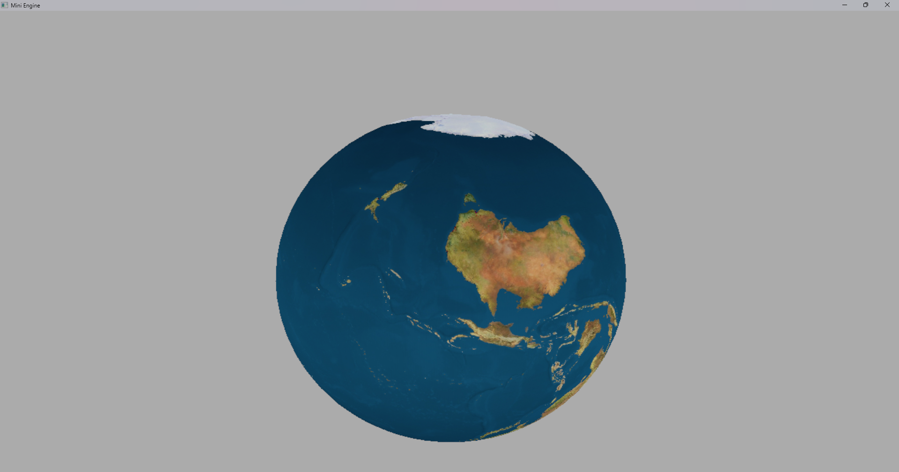

# MiniEngine

> C++ / DirectX 11로 직접 구현하는 학습용 미니 게임 엔진.
> 언리얼 엔진의 설계 철학(Actor·Component·라이프사이클)을 참고해 구조를 잡고, 엔진 내부 동작 원리를 직접 구현하며 이해하는 것을 목표로 한다.



<sub>OBJ 메시 + WIC 텍스처 로딩으로 렌더링한 3D 지구 모델 (자유 시점 카메라)</sub>

---

## 핵심 기능

| 영역 | 구현 내용 |
|------|-----------|
| **렌더링** | Direct3D 11 파이프라인 (Device / SwapChain / RTV / **깊이 테스트(DSV)** / Viewport), 상수 버퍼 기반 WVP 변환 |
| **렌더 구조** | `RenderCommand` 큐로 드로우 호출 추상화 → `Layer(Pass)` 단위 그룹화 (**Opaque / Wireframe**), 핸들 기반 GPU 버퍼 관리 |
| **에셋** | 직접 작성한 **OBJ 메시 파서**(정점 중복 제거), **WIC 기반 텍스처 로딩** + UV 샘플링 |
| **씬 / 오브젝트** | 컴포넌트 기반 `Actor` (`AddComponent<T>()` / `GetComponent<T>()`), `Level` 씬 관리 |
| **컴포넌트** | `Transform`(Root) · `Camera` · `Input` · `BoxCollider` |
| **카메라** | 자유 시점 — WASD 이동 + 마우스 우클릭 회전, View / Projection 행렬 |
| **수학** | 자체 구현 `Vector2/3/4`, `Matrix4`(행렬 곱·역행렬·원근 투영) — **단위 테스트 포함** |
| **시간** | `Time` 시스템 — 델타 스무딩, `TimeScale`(슬로우 모션 / 일시정지) |
| **입력** | `Pressed / Held / Released` 3종 키 상태, **커맨드 패턴** 바인딩 |

> 조명(Phong) · 머티리얼은 진행 중입니다. [로드맵](#로드맵)을 참고하세요.

---

## 데모

`world.obj` 메시와 텍스처를 로드해 **텍스처가 매핑된 3D 지구**를 렌더링하고, 자유 시점 카메라로 둘러볼 수 있다. (위 스크린샷)

---

## 기술 스택

- **언어**: C++20
- **그래픽스**: Direct3D 11
- **플랫폼**: Win32 (Windows)
- **테스트**: GoogleTest
- **빌드**: Visual Studio (MSVC v145 툴셋, Windows SDK 10)

---

## 빌드 & 실행

1. `Engine.slnx` 를 Visual Studio로 연다.
2. 구성: `x64` / `Debug` 또는 `Release`
3. **`Game`** 프로젝트를 시작 프로젝트로 설정한 뒤 실행(F5).

> ⚠️ 현재 데모(`TestMeshActor`)의 모델·텍스처 경로가 로컬 **절대 경로로 하드코딩**되어 있습니다.
> 클론 후 바로 실행하려면 에셋을 준비하고 `Game/Actor/TestMeshActor.cpp`의 경로를 수정해야 합니다. *(상대 경로 + 에셋 동봉으로 개선 예정)*

### 단위 테스트
`Tests` 프로젝트를 시작 프로젝트로 설정 후 실행.

```
[==========] Running 89 tests from 6 test suites.
[  PASSED  ] 89 tests.
```

| 스위트 | 테스트 수 | 검증 항목 |
|---|---|---|
| `Vector2/3/4Test` | 2 / 19 / 18 | 산술, 내적·외적, 정규화, 동등 비교 |
| `Matrix4Test` | 21 | 행렬 곱, 역행렬, 변환, 투영 |
| `TimeTest` | 17 | 델타 스무딩 / 클램프, Pause / Resume |
| `LevelTest` | 12 | Actor 추가·제거 / owner / 삭제 성능 |

---

## 아키텍처

```
Engine/                 # 엔진 (게임에 의존하지 않는 단방향 구조)
├── Actor/              # 게임 오브젝트 베이스
├── Common/             # ENGINE_API 매크로, 커스텀 RTTI
├── Component/          # Camera · Transform · Input · Physics(Collider)
├── Core/               # Input · Win32Window · Time · Log · CollisionSystem
├── Engine/             # 엔진 코어, 게임 루프
├── Level/              # 씬(레벨) 관리
├── Math/               # Vector2/3/4, Matrix4
├── Renderer/           # IRenderer, D3D11Renderer, Mesh, Texture, RenderLayer
└── Shader/             # HLSL (Mesh VS/PS 등)
Game/                   # 엔진을 사용하는 게임 코드 (Actor, main)
Tests/                  # GoogleTest 단위 테스트
```

### 코드 원칙

| 항목 | 내용 |
|------|------|
| 메모리 | 소유권은 `unique_ptr`, 참조는 raw pointer. `new`/`delete` 직접 사용 금지 |
| 의존성 | **게임 → 엔진 단방향.** 엔진은 게임 코드를 모른다 |
| 네이밍 | 언리얼 스타일 — 클래스 PascalCase, 멤버 camelCase, 라이프사이클(`BeginPlay`/`Tick`/`OnDestroy`) |

---

## 주요 설계 결정

구현 과정에서 마주친 문제와 선택의 근거. 상세 내용은 **[개발 일지(DEVLOG.md)](DEVLOG.md)** 참고.

- **Actor 삭제 성능 O(n²) → O(n)** — `vector::erase` 반복 대신 swap-and-pop으로 교체.
  10,000개 일괄 삭제 기준 **1046ms → 12ms**.
- **BeginPlay 라이프사이클 재설계** — 매 프레임 플래그 폴링 대신, "월드에 편입되는 시점 1회 호출"이라는 의미를 구조 자체로 표현.
- **의존성 단방향 유지** — 입력 처리는 `ICommand` 인터페이스로 분리하고 `QuitEngine()`을 static화해, 엔진이 게임을 역참조하지 않도록 설계.
- **언리얼식 컴포넌트 조합** — `dynamic_cast` 대신 커스텀 RTTI(`As<T>()`)로 타입 조회.

---

## 로드맵

| 단계 | 내용 | 상태 |
|------|------|------|
| 1단계 | 코어 정리 (네이밍, 라이프사이클, Actor 상태) | ✅ 완료 |
| 2단계 | Input (Pressed / Held / Released) | ✅ 완료 |
| Win32 | Win32 창 시스템, 메시지 루프 통합 | ✅ 완료 |
| 3단계 | Component 시스템 (`AddComponent<T>()`, `InputComponent`) | ✅ 완료 |
| 4단계 | DX11 렌더러 기초 (IRenderer, SwapChain, RenderCommand) | ✅ 완료 |
| 4.5단계 | Time 시스템 (DeltaTime, TimeScale) | ✅ 완료 |
| 4.8단계 | 경량 Pass Scheduler (Opaque / Wireframe Layer) | ✅ 완료 |
| 5단계 | DX11 심화 (Transform, 카메라, **메시·텍스처 ✅**, 머티리얼·Phong 조명) | 🔄 진행 중 |
| 6단계 | Deferred Rendering | 🔲 예정 |
| 7단계 | PBR | 🔲 예정 |
| 8단계 | 충돌 시스템 (AABB ✅ / BVH) | 🔄 진행 중 |
| 9~13단계 | 리소스 관리 · Level 고도화 · 메모리 관리 · 직렬화 · 데모 게임 | 🔲 예정 |

---

## 더 보기

- 📓 **[개발 일지 (DEVLOG.md)](DEVLOG.md)** — 단계별 구현 과정과 설계 결정의 상세 기록
