# MiniEngine

> C++20과 DirectX 11로 Win32 창 생성부터 렌더링 파이프라인, Actor/Component 생명주기까지 직접 구현하며 게임 엔진의 내부 구조를 학습하는 개인 프로젝트입니다.

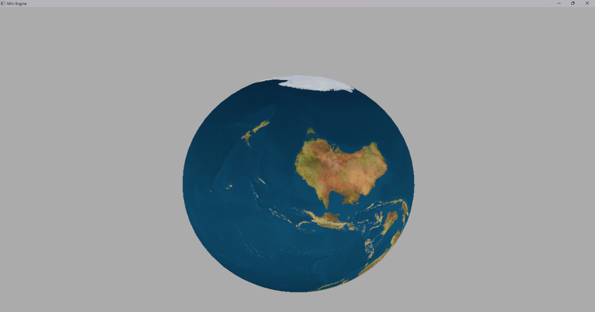

<sub>OBJ 메시 파싱 · WIC 텍스처 로딩 · WVP 변환 · 자유 시점 카메라를 연결한 데모</sub>

## 현재 상태

코드 확인 기준: [`2dbab22`](https://github.com/yj9809/MiniEngine/commit/2dbab22b77ef95f40e5d8cdbaf61f6899c25e440) (2026-10-09 문서 점검)

현재는 개편된 Notion 로드맵의 **0단계 — 기존 기반 정리와 보강**을 진행하고 있습니다. `DirectionalLightActor`를 Game에 배치해 기존 광원 전달 경로를 데모에서 소비하도록 연결했고, `Engine::Create()`가 초기화된 엔진 또는 단계별 오류를 반환하도록 생성과 초기화를 분리했습니다. Game은 생성 결과를 확인한 뒤에만 게임 루프에 진입합니다.

현재 GPU 업로드는 첫 방향광 1개로 제한됩니다. Bootstrap의 실패 전파·부분 초기화 정리·종료 계약, 런타임 Component 추가 정책과 최신 실행 검증은 남아 있습니다. 구현 존재와 통합·빌드·테스트·실행 검증을 구분하며, 개발 중인 범용 엔진 전체의 완성을 의미하지 않습니다.

완성된 범위와 현재 확장 중인 범위를 구분하면 다음과 같습니다.

| 영역 | 현재 수준 | 상태 |
|---|---|---|
| Win32 런타임 | 창, 메시지 루프, 목표 프레임 루프 | 기반 구현 / 실패·종료 경로 보강 중 |
| Engine Bootstrap | `Create()` → 단계별 `Initialize()` 결과 → Game의 오류 분기 | 코드 연결 / 실패 주입·최신 실행 검증 대기 |
| Actor / Component | `Initialize` → `BeginPlay` → `OnDestroy` 상태 디스패치, 지연 추가/제거, Root Transform | 기반 완료 / Initialize 이후 Component 추가 경로 보강 중 |
| DX11 기반 | Device · SwapChain · RTV · DSV · Viewport · 상수 버퍼 | 완료 |
| 3D 렌더링 | WVP, 자유 시점 카메라, 깊이 테스트, Indexed Draw | 완료 |
| 에셋 | OBJ 파서, WIC 텍스처 로더, GPU 핸들 관리, 경로별 `ResourceManager` 공유 캐시 | 데모 소비 경로 연결 완료 |
| Material | BaseColor · MainTexture, PS 상수 버퍼 연동 | 완료 |
| 기본 조명 | World Normal, Directional Lambert, Uniform Ambient | 화면 자료 확인 / 최신 SHA 실행 검증 대기 |
| LightingSystem | 공통 등록 훅, Level 단위 등록·해제, 방향·색상·강도 수집 | CPU 프레임 데이터 연결 완료 |
| RenderingSystem | 메시 명령과 방향광 프레임 데이터를 렌더러에 제출 | Game 방향광 배치 연결 / 최신 실행 검증 대기 |
| 방향광 GPU 경로 | 최대 4개 배열 상수 버퍼, 개수 기반 셰이더 누적 | 첫 번째 방향광 1개만 업로드 |
| 충돌 | `BoxCollider`, AABB overlap, 등록 컨테이너 | 기반 구현 / 게임 루프 통합 미완료 |

## 무엇을 직접 구현했는가

### 렌더링 파이프라인

```text
MeshRendererComponent
  └─ BeginPlay 등록 / OnRemove 해제
      ↓
Level::Draw → RenderingSystem
  └─ RenderCommand 구성 · 제출
      ├─ Buffer / Texture Handle
      ├─ World · View · Projection
      └─ Material BaseColor
          ↓
LayerScheduler
  ├─ OpaqueLayer
  │   ├─ WVP / World / Material / Lighting Constant Buffer
  │   └─ Mesh VS · PS + Texture SRV
  └─ WireframeLayer
      └─ 전용 VS · PS와 Rasterizer State
          ↓
Direct3D 11 DrawIndexed

DirectionalLightComponent
  └─ LightingSystem 등록 · CPU RenderData 수집
      ↓
RenderingSystem → D3D11Renderer::RenderFrameData
  └─ OpaqueLayer Lighting Constant Buffer
      └─ 첫 번째 방향광 → Mesh Pixel Shader
```

- `IRenderer`와 `D3D11Renderer`를 분리해 게임 코드가 D3D11 구현 세부사항을 직접 참조하지 않도록 구성했습니다.
- `RenderingSystem`이 현재 Level에 등록된 `MeshRendererComponent`를 순회하고, 카메라의 View/Projection과 각 Actor의 World 행렬로 `RenderCommand`를 구성해 제출합니다.
- Component 생명주기의 비공개 시스템 훅이 `BeginPlay` 직전에 등록하고 `OnRemove` 직전에 해제합니다. `LightComponent`가 Level의 `LightingSystem` 연결을 공통 처리하고, 구체 광원은 타입별 등록·해제만 구현합니다.
- `DirectionalLightComponent`는 Root Transform의 +X Forward를 방향으로 사용하고, 색상·강도와 함께 CPU 렌더 데이터로 변환합니다. `LightingSystem`이 등록된 방향광 전체를 수집해 `RenderingSystem`과 `D3D11Renderer`의 프레임 데이터로 전달합니다.
- OpaqueLayer와 HLSL의 방향광 배열 용량은 4개지만 현재 업로드 구현은 목록의 첫 번째 광원만 0번 슬롯에 기록하고 개수를 1로 설정합니다. 셰이더는 전달된 개수만큼 누적하도록 구성되어 있으나 다중 광원 업로드는 아직 연결되지 않았습니다.
- 렌더 요청을 `RenderCommand`로 모은 뒤 Opaque/Wireframe 버킷에서 실행합니다. 현재 구조가 Render Target을 소유하는 진짜 RenderPass가 아니라는 점을 확인해 이름을 `RenderLayer`로 정정했습니다.
- OBJ의 position/normal/UV를 파싱하고 중복 정점을 제거해 Vertex/Index Buffer를 생성합니다.
- WIC로 이미지를 RGBA8로 변환하고 Texture2D/SRV를 생성해 픽셀 셰이더에서 샘플링합니다.
- Material의 BaseColor와 Texture를 렌더 명령으로 전달하고, Lambert Diffuse와 Uniform Ambient를 적용하는 셰이더 경로를 구현했습니다.

| Directional Lambert만 적용 | Uniform Ambient 추가 |
|---|---|
| 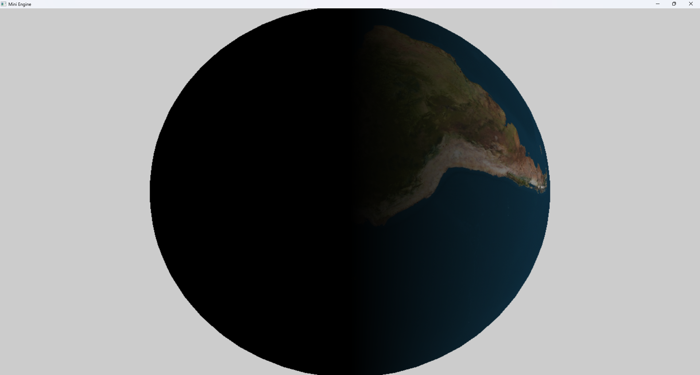 | 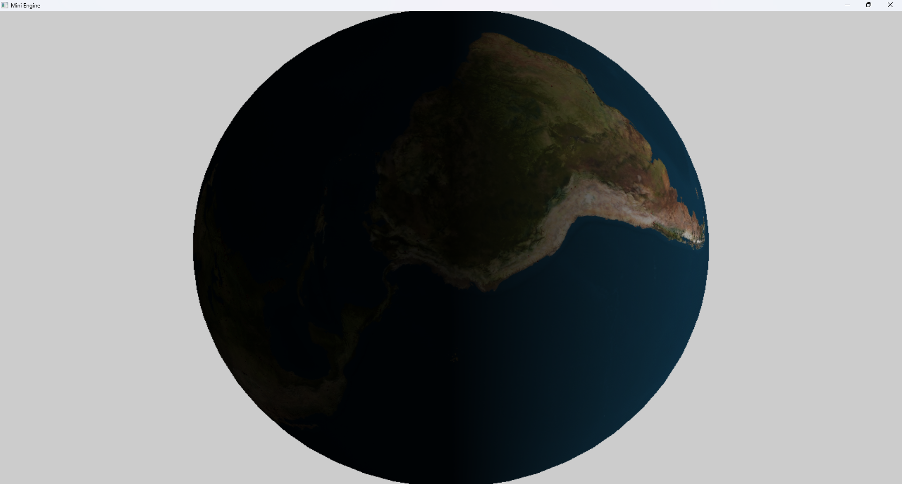 |

왼쪽은 광원이 닿지 않는 면이 완전히 어두운 Lambert 단독 결과이고, 오른쪽은 Uniform Ambient를 더해 암부의 기본 밝기를 보완한 결과입니다.

### 오브젝트와 생명주기

```text
Level
  └─ Actor (unique_ptr 소유)
      ├─ TransformComponent (Root)
      ├─ CameraComponent
      ├─ MeshRendererComponent
      ├─ InputComponent
      └─ Collider / Light Component
```

- Actor가 Component를 `unique_ptr`로 소유하고, 외부에서는 비소유 raw pointer로 관찰합니다.
- 순회 중 컨테이너 무효화를 피하기 위해 Actor 추가·삭제를 프레임 경계에서 일괄 처리합니다.
- 반복 `vector::erase`로 인한 O(n²) 삭제를 swap-and-pop으로 변경했습니다. 당시 개발 일지의 10,000개 일괄 삭제 측정은 1046ms에서 12ms로 감소했습니다.
- “객체 구성”과 “런타임 진입”이 섞여 있던 문제를 분리해 `Initialize`와 `BeginPlay` 디스패치를 추가하고, 중복 호출·재진입·순서 역전을 상태로 차단했습니다.
- 종료도 `DispatchOnDestroy()` → Actor `OnDestroy()` → Component `OnRemove()` 순으로 일원화하고, 중복 종료를 상태로 차단했습니다. 메시 렌더러와 광원 컴포넌트는 실제 등록했던 시스템에서 해제합니다.
- 현재 Level에 대기 중인 Actor는 프레임 경계에서 `DispatchInitialize()` → `DispatchBeginPlay()` 순으로 진입합니다. 다만 `Initialize` 이후 새로 생성한 Component가 같은 디스패치 경로를 자동으로 거치는 연결은 아직 보강 대상입니다.

### 엔진 생성과 초기화

- `Engine::Create()`는 `std::variant<std::unique_ptr<Engine>, EngineInitError>`를 반환합니다. 생성자는 비공개이고, 초기화는 Settings → Window → Renderer → Resource 순으로 수행합니다.
- `Game/Main.cpp`는 `EngineInitError`이면 메시지를 `stderr`에 출력하고 실패 종료하며, 성공한 엔진으로 Level을 구성한 뒤 `Run()`을 호출합니다.
- 정상 종료 코드는 Level → ResourceManager → Renderer 순으로 정리합니다. 부분 초기화 실패의 정리 계약과 정확히 한 번 종료되는지는 별도 검증 대상입니다.
- 아직 설정 파일 열기 실패를 오류로 반환하지 않으며, `Win32Window` 소멸자에는 창/클래스 해제 코드가 없습니다. D3D 오류 경로의 `__debugbreak()`도 남아 있어 디버거 없는 실패 반환을 보장한 상태는 아닙니다.
- Engine은 `final`이며 Game은 상속 대신 생성 결과를 받아 조합합니다. Level 전환의 null 입력·실패·프레임 경계 정책은 미완료입니다.

### 기반 시스템

| 시스템 | 구현 내용 |
|---|---|
| Math | `Vector2/3/4`, `Matrix4`, 행렬 곱·역행렬·LookAt·PerspectiveFOV |
| Input | Pressed / Held / Released, 마우스 delta, 커서 잠금, Command 바인딩 |
| Time | `QueryPerformanceCounter`, DeltaTime, 이동 평균, clamp, TimeScale, Pause/Resume |
| Camera | WASD 이동, 마우스 우클릭 회전, View / Projection 분리 dirty flag |
| Logging | Debug 빌드용 `OutputDebugStringA` 기반 로그 |
| Resource | Engine 소유, 메시·텍스처 경로별 `shared_ptr` 캐시, Renderer보다 앞선 정리 순서 |
| System | Level 소유 Lighting / RenderingSystem, 생명주기 등록·해제, CPU 프레임 데이터 전달 |

## 데모

### 방향광 데모

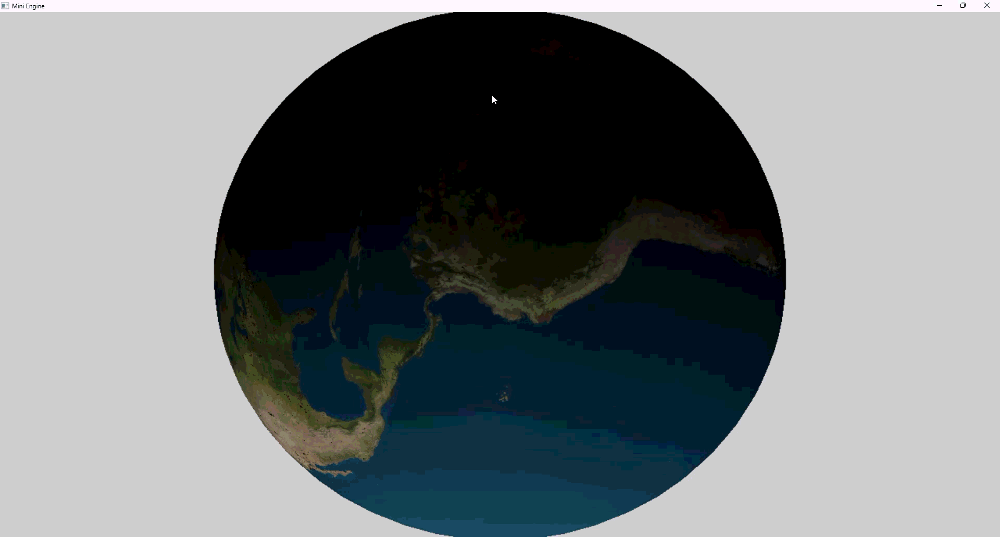

`DirectionalLightActor`는 생성자에서 광원 Component를 구성하고, Initialize에서 흰색·Intensity 1.0과 초기 회전을 설정합니다. Tick에서 Pitch를 초당 100도 증가시키며, Game/Main이 이를 Level에 추가합니다.

이 GIF는 저장소에 제공된 화면 자료입니다. 여러 프레임의 지구 출력은 확인했으나, 캡처 창 제목은 `Mini Engine`이고 현재 Bootstrap 코드는 `Eden Engine`을 사용합니다. 캡처 당시 SHA·빌드 구성을 확인할 수 없어 최신 `b210cdf` 이후 Bootstrap 실행 성공이나 Color/Intensity 변경·다중 광원 검증의 근거로 확대하지 않습니다.

### 회전 규칙과 확인 경계

`TransformComponent`의 Euler 입력은 `Vector3(x, y, z) = Pitch, Yaw, Roll`이며 +X를 Forward로 사용합니다. 현재 행렬 구성은 이 좌표계와 회전 방향을 맞추기 위해 `Rotation(-Roll, -Pitch, Yaw)`를 사용합니다. 데모에서는 `1` / `2` / `3` 키로 Pitch / Yaw / Roll 회전을 각각 토글합니다.

기존 X/Y/Z 및 짐벌락 GIF는 이 의미 정리 전 기록입니다. 별도 캡처 폴더의 Pitch/Yaw/Roll GIF도 최종 Roll 부호 수정 `c9bfdfd` 전에 생성되어 최신 HEAD 실행 증거로 게시하지 않았습니다. 쿼터니언 도입 전까지 오일러 회전의 짐벌락 가능성은 남아 있으며, 현재 규칙을 반영한 새 실행 캡처가 필요합니다.

## 빌드와 검증

### 요구 환경

- Windows 10/11
- Visual Studio 2026 Community 또는 MSVC v145 호환 환경
- Windows SDK 10
- vcpkg manifest mode (`vcpkg.json`의 GoogleTest 의존성)
- x64

### 빌드 절차

1. `Engine.slnx`를 Visual Studio로 엽니다.
2. `x64`와 `Debug` 또는 `Release`를 선택합니다.
3. `Game` 프로젝트를 시작 프로젝트로 설정합니다.
4. 빌드 후 실행 파일 옆으로 복사된 `Asset/`과 `Shader/`를 사용해 실행합니다.

테스트는 같은 솔루션의 `Tests` 프로젝트가 `LevelTest.cpp`와 `RenderingSystemTest.cpp`를 포함한 전체 테스트 소스를 빌드하도록 구성되어 있습니다. `LightComponent.cpp`도 Engine 프로젝트 빌드 대상에 등록되어 있습니다. 이 문서 갱신에서는 별도 빌드나 실행을 수행하지 않았습니다.

### 검증 현황

기존 OBJ + Texture + Camera 데모와 Lambert / Ambient 결과는 실행 이미지와 GIF로 확인했습니다. 2026-10-05 기록에서는 생명주기·수학·Time의 6개 스위트, 86개 테스트가 모두 통과했습니다. 아래 기존 6개 캡처는 그 시점의 실행 기록이며, 현재 코드 확인 기준의 전체 회귀 결과가 아닙니다.

현재 테스트 소스에는 총 106개 케이스가 선언되어 있고, `Tests.vcxproj`는 Level 테스트를 다시 포함하며 `Tests/Main.cpp`는 필터 없이 `RUN_ALL_TESTS()`를 호출합니다.

| 스위트 | 케이스 | 범위 |
|---|---:|---|
| Vector2 / 3 / 4 | 2 / 19 / 18 | 산술, 내적·외적, 정규화, 상수 |
| Matrix4 | 21 | 변환, 역행렬, LookAt, 투영 |
| Time | 17 | 스무딩, clamp, TimeScale, Pause/Resume |
| Lifecycle | 11 | 호출 순서, 1회 보장, 재진입·순서 역전, 종료 순서 |
| Level | 12 | Actor 추가·제거, owner, 대량 처리 — 빌드 대상에 재포함 |
| RenderingSystem | 6 | 중복 등록, 제거 안전성, Level 격리, 명령 제출 |

2026-10-06 캡처에서는 변경된 Lifecycle 11개와 새 RenderingSystem 6개를 각각 실행해 각 항목의 `OK`를 확인했습니다. 이는 두 스위트의 별도 실행 증거이며, 전체 106개 또는 최신 HEAD의 통합 통과 증거는 아닙니다. 이후 테스트 선언 수는 106개로 유지됐고, RenderingSystem 테스트용 렌더러에 방향광 제출 인터페이스가 추가됐지만 광원 데이터의 수집·GPU 전달을 확인하는 새 테스트 단언은 없습니다. 최신 로드맵(2026-10-09)은 `b210cdf` 기준 Release x64 빌드와 전체 106개 테스트 통과를 기록합니다. 이번 점검에서는 해당 실행 로그나 최신 SHA에 대응하는 결과 파일을 확인하지 못했으므로 **문서에 남은 통과 기록**과 **직접 재실행한 결과**를 구분합니다. Debug 최종 링크와 변경된 Bootstrap의 실제 Game 실행은 로드맵에서도 미완료입니다. 이후 `4a756a7`은 데모 코드, `2dbab22`는 GIF를 변경했으며 최신 SHA의 전체 검증 결과는 확인되지 않았습니다.

| Lifecycle (11, 2026-10-06) | RenderingSystem (6, 2026-10-06) |
|---|---|
| 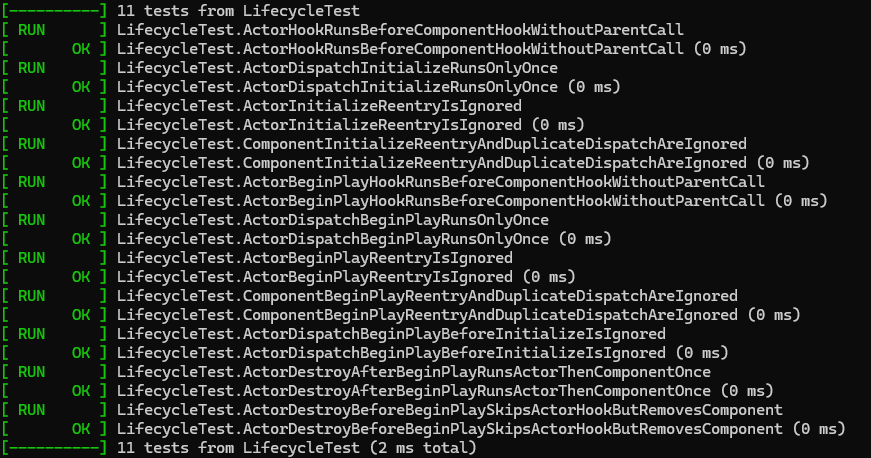 | 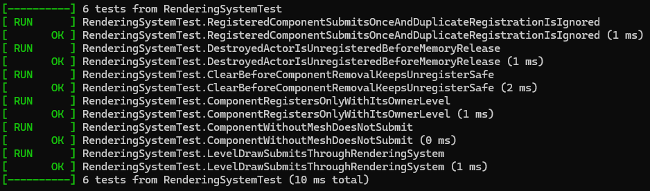 |

| Lifecycle (과거 9) | Matrix4 (21) |
|---|---|
| 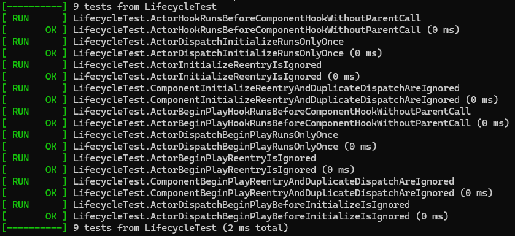 | 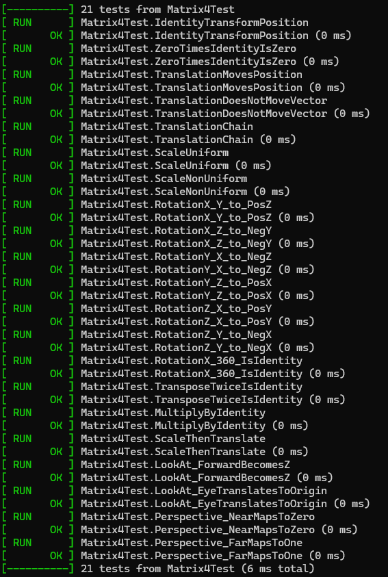 |

| Time (17) | Vector2 (2) |
|---|---|
| 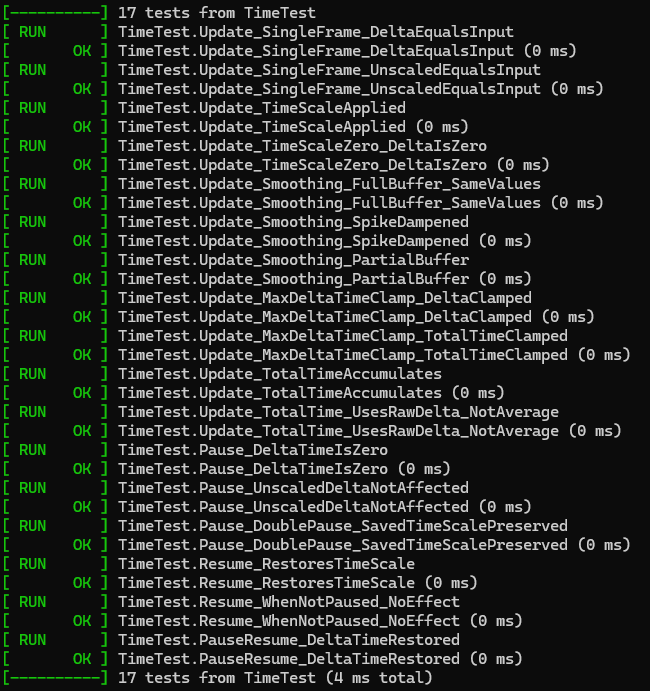 | 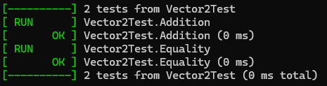 |

| Vector3 (19) | Vector4 (18) |
|---|---|
| 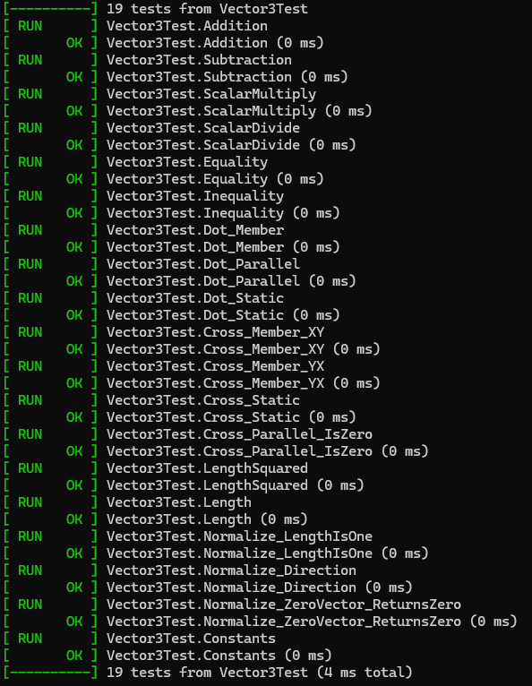 | 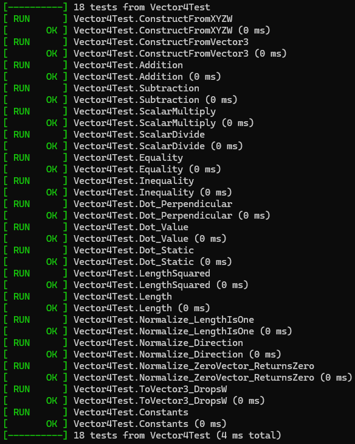 |

## 주요 설계 판단

| 판단 | 이유 |
|---|---|
| RenderPass 대신 RenderLayer | 현재 구조는 RT 소유·패스 간 SRV 의존성이 아니라 Draw 분류 버킷이므로 실제 책임에 맞게 명명 |
| Light 데이터와 Light Component 분리 | 광원 데이터가 Actor/Component 계층이나 GPU 버퍼 형식에 종속되지 않도록 경계 설정 |
| CPU Light와 GPU Constant Buffer 분리 | 의미 중심의 CPU 데이터와 정렬·전송 중심의 GPU 표현을 독립적으로 변경하기 위함 |
| RenderFrameData로 프레임 입력 전달 | 광원 컴포넌트와 RenderLayer가 직접 결합하지 않고 렌더러가 프레임 단위 데이터를 공유하도록 경계 설정 |
| 프레임 경계에서 Actor 추가·삭제 | Tick/Draw 순회 중 컨테이너 변경과 iterator 무효화 방지 |
| Handle 기반 GPU 리소스 참조 | 게임 오브젝트가 D3D11 COM 객체를 직접 소유하지 않도록 렌더러에 수명 관리 집중 |
| Engine 소유 ResourceManager | Level 교체와 무관하게 공유 리소스를 재사용하고 Renderer보다 먼저 캐시를 해제하기 위함 |
| Level 소유 RenderingSystem | 월드별 렌더 대상을 분리하고 `EndLevel()`에서 비소유 등록 목록을 명시적으로 정리하기 위함 |

## 개발 이력

| 시기 | 주요 결과 | 대표 커밋 |
|---|---|---|
| 2026-03 | Actor/Level 생명주기, Input, Component, AABB 기반 | `8827f0f` · `f17a90f` · `1cddd3d` |
| 2026-04 | DX11 초기화, 수학, RenderCommand, Time, RenderLayer, Camera | `9414065` · `6245c44` · `5595eff` · `acfc93f` |
| 2026-05 | OBJ 메시, MeshRenderer, WIC 텍스처 | `0cf264f` · `5ce9493` |
| 2026-06 | Z-up 전환, 회전 데모, 상대 에셋 경로 | `9963637` · `af58973` |
| 2026-09 | Material, BaseColor, Lambert + Ambient | `b956a29` · `c1ac4c5` · `714511c` · `dc8a878` |
| 2026-10 | RenderingSystem 통합, 종료 생명주기, Pitch/Yaw/Roll 규칙, 광원 등록 공통화와 첫 방향광 GPU 전달, DirectionalLightActor, Engine 생성/초기화 분리 | `381b4c2` · `7508012` · `c9bfdfd` · `3a09184` · `c109d60` · `f3e58f3` · `ab373a3` · `b210cdf` |

## 로드맵

[최신 Notion 개발 로드맵](https://app.notion.com/p/3218d1fa63aa817ab92eddf6e8e86b24)의 2026-10-08 개편 구조를 기준으로 진행합니다. 개발 일지와 DEVLOG의 기존 1~5-7 단계명은 당시 구현 이력이며 현재 단계 번호와 구분합니다.

| 단계 | 내용 | 상태 |
|---|---|---|
| 0 | 기존 기반 보강 · Bootstrap/Shutdown · Logging Foundation | 진행 중 |
| 1 | 엔진 데이터 계층·변환 규칙 · Environment Lighting | 예정 |
| 2 | Quaternion Transform · Transform 계층 | 예정 |
| 3 | Forward Lighting 기준선 | 예정 |
| 4 | RenderPass · HDR · Shadow · 공용 DebugDraw | 예정 |
| 5 | Deferred Rendering | 예정 |
| 6 | PBR · glTF 정적 Asset · Environment Lighting | 예정 |
| 7 | 안정적인 Type Registry 기반 Scene과 Resource | 예정 |
| 8 | Runtime Engine Tools | 예정 |
| 9 | Input Mapping · Collision · Character Runtime | 예정 |
| 10 | Skeletal Animation | 예정 |
| 11 | 별도 Action Framework | 예정 |
| 12 | 최소 Audio · Runtime HUD · 선택 VFX | 예정 |
| 13 | Renderer Lab · Action Combat Arena 통합 검증 | 예정 |

다음 순서는 **남은 기반 보강 → 기존 `Engine::Log` 확장 → Data Contract v1**입니다. 먼저 Bootstrap 실패·종료 계약과 런타임 생성/제거 정책을 고정하고 최신 빌드·테스트·Game 실행을 검증합니다. 다중 광원 업로드와 Ambient Albedo 중복 곱셈, Quaternion·고급 렌더링은 후속 단계에서 다룹니다. 측정된 필요성이 없는 범용 RenderGraph·BVH·Custom Allocator는 선행하지 않습니다.

## 프로젝트 구조

```text
Engine/
├─ Actor/          # Actor 생명주기와 Component 소유
├─ Component/      # Transform, Camera, Mesh, Input, Physics, Light
├─ Core/           # Win32, Input, Time, Log
├─ Engine/         # 게임 루프와 렌더러 소유
├─ Level/          # Actor 컨테이너와 프레임 경계 처리
├─ Math/           # Vector / Matrix
├─ Resource/       # Mesh / Texture 공유 캐시
├─ Renderer/       # D3D11, Mesh, Texture, Material, RenderLayer
├─ System/         # Collision, Lighting, RenderingSystem
└─ Shader/         # HLSL
Game/              # 엔진을 사용하는 데모 코드와 에셋
Tests/             # GoogleTest 단위 테스트
Docs/              # README 이미지와 GIF
```

## 문서

- [개발 일지 (repository)](DEVLOG.md)
- [MiniEngine 개발 일지 (Notion)](https://app.notion.com/p/3238d1fa63aa81368587d75d2c0bd738)
- [MiniEngine 개발 로드맵 (Notion)](https://app.notion.com/p/3218d1fa63aa817ab92eddf6e8e86b24)
- [Actor / Component 생명주기 정리 (Notion)](https://app.notion.com/p/3ec8d1fa63aa81cc8408db4a009803d2)
- [ResourceManager / RenderingSystem 연결 설계 (Notion)](https://app.notion.com/p/3f08d1fa63aa81c4a9d5f0b11473ab0a)
- [GitHub repository](https://github.com/yj9809/MiniEngine)
